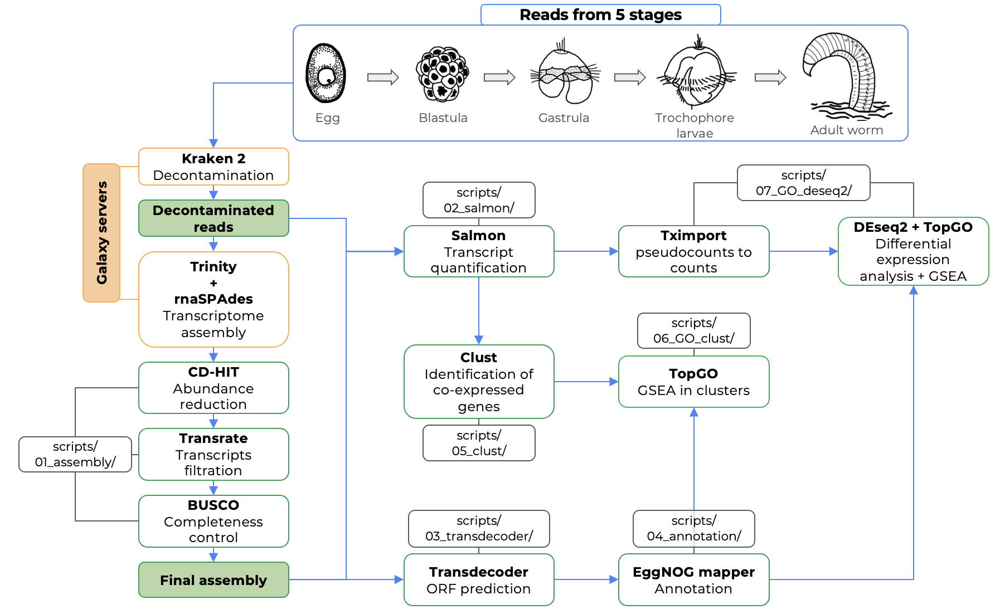
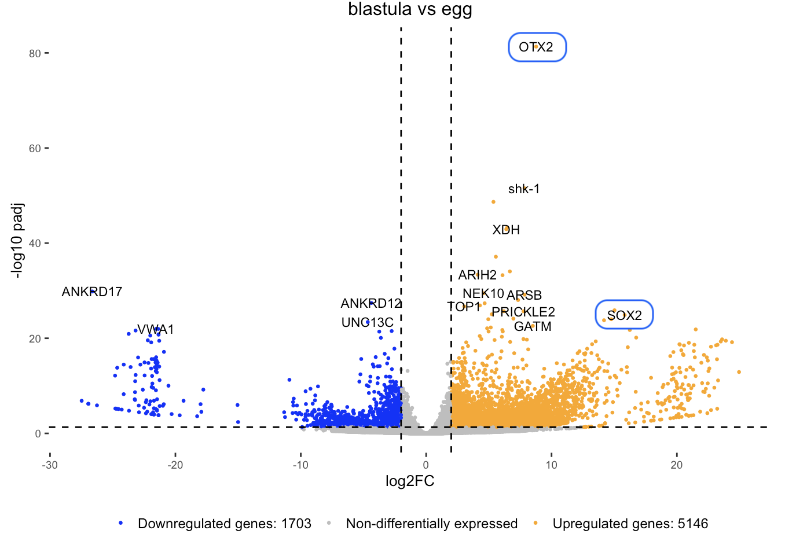
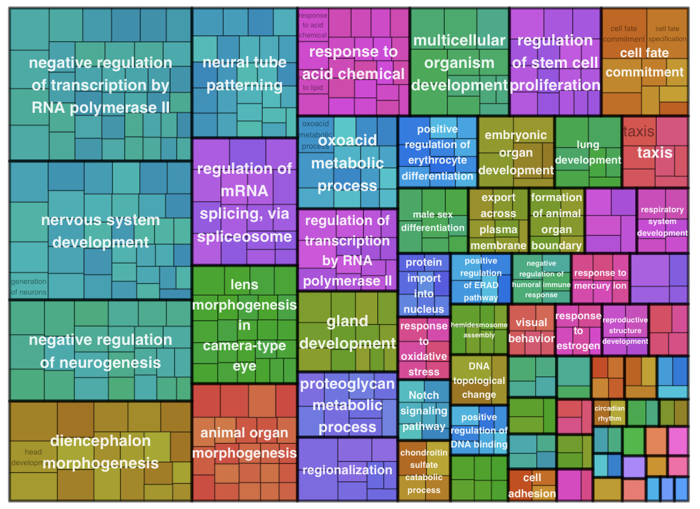
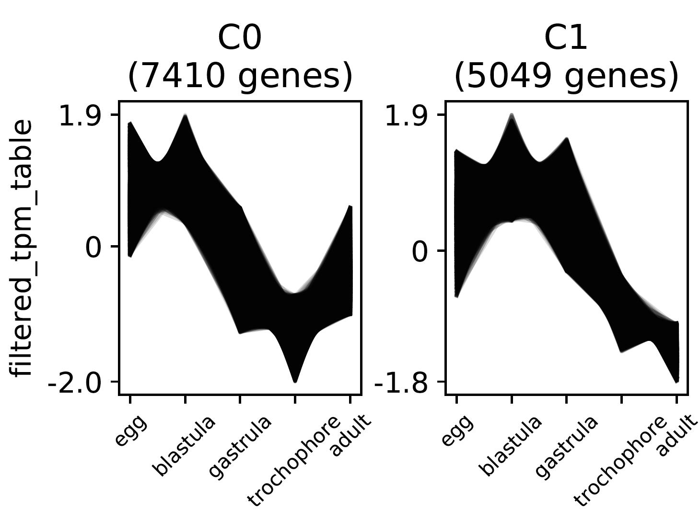
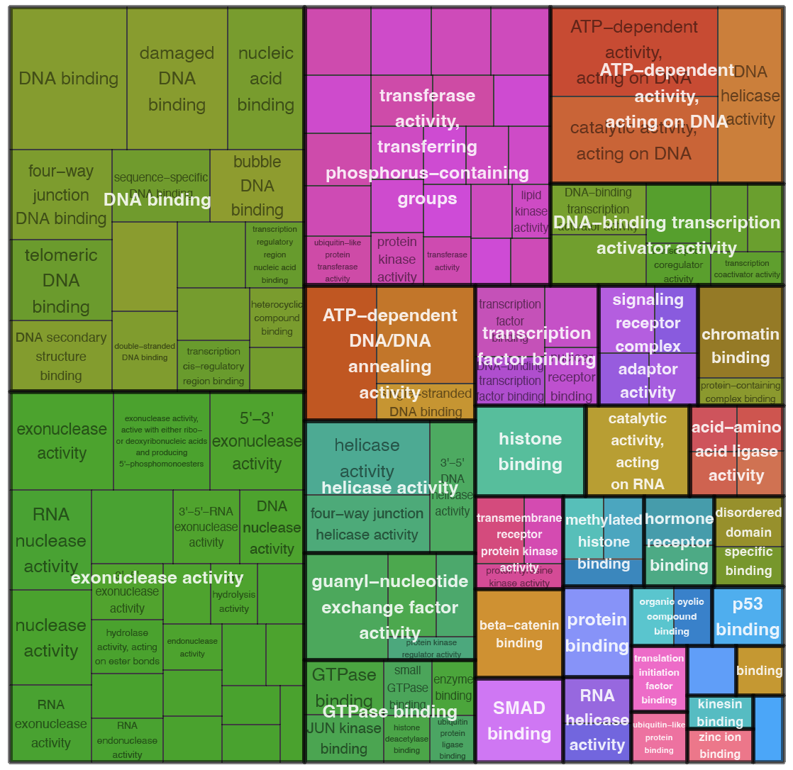
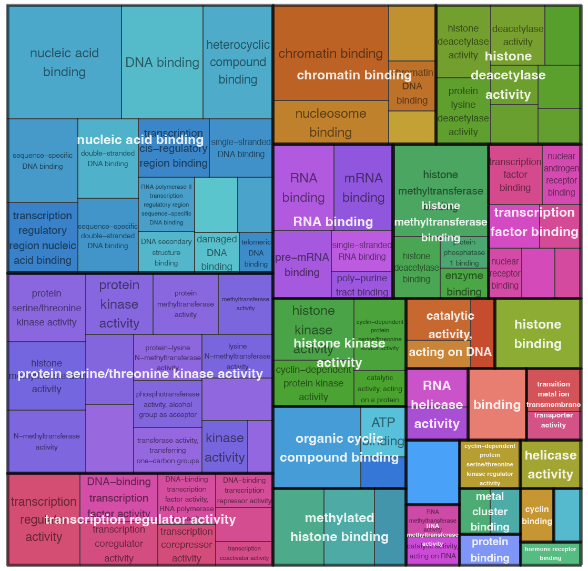

# Gene expression dynamics in the life cycle of the annelid *Ophelia limacina*

**Author:**
- Mikhail Greenberg, SPbU Embryology department

**Supervisors:**
- Vitaly Kozin, SPbU Embryology department
- Ilya Borisenko, SPbU Embryology department

## Introduction
The Spiralia group is one of the three major bilaterian clades. One of the key features of this group is its stereotypical embryonic development with early establishment of cell fates [^1] with different Spiralia species utilizing autonomous (dependent on maternal factors) and conditional (dependent on cell-cell interactions) modes of cell specification. Annelids are one of the main model taxa for studying development and evolution of Spiralia, due to of their diverse life cycles and embryonic patterns [^1].

One of the most intriguing and poorly understood aspects of Spiralian embryogenesis is zygotic genome activation (ZGA), which has been shown to act as a trigger for the initiation of complex developmental processes in other Bilateria groups [^2]. However, It is unclear how ZGA is associated with different developmental modes in Spiralia. Transcriptome profiling of early developmental stages of the unequally cleaving annelid *Platynereis* revealed that ZGA proceeds in several waves, with the major transition to the zygotic landscape coinciding with the completion of the spiral cleavage programme after autonomous specification of different cell lineages [^3][^4]. Investigating whether these developmental processes in the equally cleaving annelid *Ophelia limacina* have similar dynamics would contribute substantially to the field of evolutionary developmental biology of the Spiralia clade.

### Aim and Objectives:

**Aim:** Investigate temporal expression patterns of developmental genes throughout the life cycle of *Ophelia limacina*.

**Objectives:**  
* Transcriptome assembly for different stages of *O. limacina* life cycle
* Differential gene expression analysis (DEA) for *O. limacina* stages
	* GeneOntology (GO) enrichment analysis for differentially expressed genes (DEGs)
	* Identification of developmental genes in DEGs
* Identification of co-expressed gene clusters
  * GeneOntology (GO) enrichment analysis for clustered genes

### Data
*hpf - hours post fertilisation*

*dpf - days post fertilisation*

The data available at the start of the project were: paired reads (bulk RNA-seq data) after basic quality check and trimming for 5 consecutive stages of the *O. limacina* life cycle: 

- 0 hpf - **unfertilised egg**
- 10 hpf - **32-cell blastula**
- 24 hpf - **100+ cell gastrula**
- 4 dpf - **trochophore larvae**
- 3 years - **adult male**

There were 3 biological replicates for each stage. 

## Workflow
Whole workflow overview
:-------------------------:

### Decontamination and assembly

All reads were decontaminated using [Kraken2](https://github.com/DerrickWood/kraken2). The PlusPF (standard plus protozoa and fungi; 2022-09-04T165121Z) Kraken2 database was used for classification. Kraken2 reports visualisation performed with the online tool [Pavian](https://fbreitwieser.shinyapps.io/pavian/).

Kraken2 report visualisation for merged reads
:-------------------------:
 

For *de novo* transcriptome assembly were used 2 different assemblers: [rnaSPAdes](https://cab.spbu.ru/software/rnaspades/) (v.3.15.5) and [Trinity](https://github.com/trinityrnaseq/)(v.2.15.1). **Both decontamination and assembly were performed using public [Galaxy](https://github.com/galaxyproject) servers**.

Contigs in each assembly were clustered using [CDHIT-est](https://github.com/weizhongli/cdhit) (v.4.8.1). Contigs with 95% identity were clustered (both strands compared). Contig filtration was performed using [Transrate](https://hibberdlab.com/transrate/) (v.1.0.3). Assemblies were checked for completeness using [BUSCO](https://gitlab.com/ezlab/busco) (v.5.4.4) against the Metazoa odb10. 

Final assembly was picked based on Transrate scores and BUSCO results:

*good_oli_<...> - assembly after clusterization and Transrate filtration*
*Best assembly is highlighted with green frame*

BUSCO results for different assemblies
:-------------------------:
 

| Transrate Metric                  | rnaSPAdes assembly after clusterization | Trinity assembly after clusterisation |
|-----------------------------------|-----------------------------------------|---------------------------------------|
| Contigs before filtering          | 536541                                  | 531911                                |
| Contigs after filtering           | 532844                                  | 399678                                |
| Percent of well-assembled contigs | **99,3%**                               | 75,1%                                 |
| Percent of fragments mapped       | **95,8%**                               | 93,1%                                 |
| GC-content                        | 42,2%                                   | 42%                                   |
| Assembly score                    | 0.65593                                 | 0.34640                               |
| Optimal score                     | **0.67449**                             | 0.54867                               | 

**The best assembly was produced by rnaSPAdes.**

Protein-coding contigs in best assembly were identified with [Transdecoder](https://github.com/TransDecoder/) (v.5.7.1). Expression levels for transcripts were quantified with [Salmon](https://github.com/COMBINE-lab/salmon) (v.1.10.2). For subsequent analysis we used only contigs contigs with with protein length >= 100 aminoacids and expression level at least 1 TPM in any sample. Annotation was performed with [eggNOG-mapper](http://eggnog-mapper.embl.de/) online tool. 

### Differential expression analysis and GeneOntology enrichment analysis

Differential expression analysis was carried out with [DESeq2](https://bioconductor.org/packages/release/bioc/html/DESeq2.html) R package (v.1.44.0). Salmon pseudocounts were imported into DESeq2 with [tximport](https://bioconductor.org/packages/release/bioc/html/tximport.html) (v.1.32.0). 

Stage clustering prior to DEA revealed that replicates for each stage were similar. Comparison of stages showed that trochophore and adult stages were least similar to others:

|         PCA-plot         |       Distances heatmap        |
|:------------------------:|:------------------------------:|
|  |  |

Differential expression analysis revealed an upregulation of gene expression at the blastula stage.

Heatmap of all DEGs
:-------------------------:
 

The most upregulated genes compared to egg stage included Otx2 (anterior neural marker) and Sox2 (neural marker):

Volcano-plot for blastula vs egg comparison
:----------------------------------:

GO terms enrichment analysis for biological processes was performed for upregulated blastula genes (compared to unfertilised egg) using the [topGO](https://bioconductor.org/packages/release/bioc/html/topGO.html) (v.2.56.0) R package. Only processes with more than 10 genes were considered. Similar GO terms were grouped using the [rrvgo](https://bioconductor.org/packages/release/bioc/html/rrvgo.html) (v.1.16.0) R package. The same package was used to visualize the results in treemap plots. Such plots show all significant biological processes based on their enrichment score (-log10(Fisher's test p-values)), while a custom GO terms histogram shows the top 25 terms based on their fold enrichment. 

Upregulated processes include those related to the regulation of mRNA transcription and cell differentiation, mainly associated with the development of the nervous system.

Treemap plot   
:------------------------:
 

GO terms histogram    
:------------------------------:

A similar approach was used to compare other stages. To gain a deeper understanding of specific biological processes, the genes involved in some of these processes were examined. This approach, combined with the filtering of DEGs in different comparisons based on specific interesting GO terms involved in development (see [DESeq2_utils](/scripts/07_GO_deseq2/deseq2_utils.R) script and [terms](/scripts/07_GO_deseq2/interesting_terms.txt) used for filtering), allowed the identification of many differentially expressed developmental regulators and components of signalling pathways (see [notebook](/data/07_GO_deseq2/) for full analysis). 

Summary heatmaps:

Differentially expressed developmental regulators 
:------------------------------:

**Differentially expressed components of signaling pathways:**
|        TGF-beta         |       WNT        |
|:------------------------:|:------------------------------:|
|  |  |

Expression of various cell differentiation genes begins at the blastula stage. The expression of several anterior and neural markers (such as Foxq2, Otx2, Sox2)[^6][^7] starts earliest, whereas the peak expression of endodermal (such as GATA4, GATA6, FOXA)[^8] and mesodermal markers (FoxC, TWIST)[^8] occurs later. Many TGF-beta and WNT components are also expressed at the blastula stage.

### Analysis of co-expressed gene clusters and GeneOntology enrichment analysis

Clustering of genes with similar temporal expression patterns was performed using [Clust](https://github.com/BaselAbujamous/clust) (v.1.18.1). 5 clusters were obtained using default parameters. For each cluster we performed GO terms enrichment analysis similar to that in [DEA](#differential-expression-analysis-and-geneontology-enrichment-analysis)

Here are presented clusters with genes with early peak expression and their enriched **molecular functions**:

Big early clusters 
:------------------------------:

|        Molecular functions enriched in cluster 0         |     Molecular functions enriched in cluster 1        |
|:------------------------:|:------------------------------:|
|  |  |

These early clusters are enriched with molecular functions involved in signal trunsduction (smad binding, beta-catenin binding, transcription factor binding, signaling receptor complex adaptor activity, transmembrane receptor protein kinase activity, hormone receptor binding, etc) and chromatine modiffications (histone binding, methylated histone binding, chromatin binding, histone methyltransferase activity, histone deacetylase activity, etc). 

## Discussion

Acquired data suggest that the onset of zygotic expression in Ophelia limacina development occurs at the 32-cell blastula stage, when numerous genes being activated. This is further supported by the expression of transcription regulators and chromatin modifications at this stage, which is considered a marker of ZGA [2]. The expression of different genes involved in cell fate specification also begins at the blastula stage, primarily neural and anterior genes, while many of other developmental regulators are expressed later. This contrasts with Platynereis development, where the main cell fate specification occurs before ZGA [^3][^4]. It can also be proposed that the early expression of developmental genes in Ophelia limacina is primarily regulated by signaling cascades rather than solely by maternal factors. This is evidenced by the early expression of components of the TGF-beta and WNT pathways, which are considered conservative regulators of embryo patterning [^5].

## Future plans

## References
[^1]: Henry J. Q. (2014). Spiralian model systems. The International journal of developmental biology, 58(6-8), 389–401. https://doi.org/10.1387/ijdb.140127jh
[^2]: Lee, M. T., Bonneau, A. R., & Giraldez, A. J. (2014). Zygotic genome activation during the maternal-to-zygotic transition. Annual review of cell and developmental biology, 30, 581–613. https://doi.org/10.1146/annurev-cellbio-100913-013027
[^3]: Chou, H. C., Pruitt, M. M., Bastin, B. R., & Schneider, S. Q. (2016). A transcriptional blueprint for a spiral-cleaving embryo. BMC genomics, 17, 552. https://doi.org/10.1186/s12864-016-2860-6 ↩
[^4]: Vopalensky, P., Tosches, M. A., Achim, K., Handberg-Thorsager, M., & Arendt, D. (2019). From spiral cleavage to bilateral symmetry: the developmental cell lineage of the annelid brain. BMC biology, 17(1), 81. https://doi.org/10.1186/s12915-019-0705-x 
[^5]: Genikhovich, G., & Technau, U. (2017). On the evolution of bilaterality. Development (Cambridge, England), 144(19), 3392–3404. https://doi.org/10.1242/dev.141507 
[^6]: Liang, Y., Carrillo-Baltodano, A. M., & Martín-Durán, J. M. (2023). Emerging trends in the study of spiralian larvae. Evolution & development, e12459. Advance online publication. https://doi.org/10.1111/ede.12459
[^7]: Sur, A., Renfro, A., Bergmann, P. J., & Meyer, N. P. (2020). Investigating cellular and molecular mechanisms of neurogenesis in Capitella teleta sheds light on the ancestor of Annelida. BMC evolutionary biology, 20(1), 84. https://doi.org/10.1186/s12862-020-01636-1
[^8]: Martín-Durán, J. M., Passamaneck, Y. J., Martindale, M. Q., & Hejnol, A. (2016). The developmental basis for the recurrent evolution of deuterostomy and protostomy. Nature ecology & evolution, 1(1), 5. https://doi.org/10.1038/s41559-016-0005

